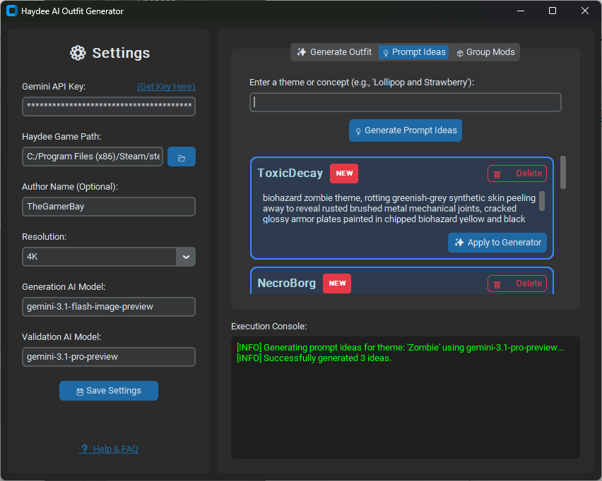

> 🌐 **Idiomas:** [English](README.md) | [Русский](README.ru.md) | [ไทย](README.th.md) | [中文](README.zh.md) | [Español](README.es.md) | [العربية](README.ar.md)

# Haydee AI Outfit Generator GUI

[](https://github.com/thegamerbay/haydee-ai-outfit-generator-gui/actions/workflows/ci.yml)
[](https://github.com/thegamerbay/haydee-ai-outfit-generator-gui/actions/workflows/release.yml)
[](https://github.com/thegamerbay/haydee-ai-outfit-generator-gui/actions/workflows/tests.yml)
[](https://github.com/thegamerbay/haydee-ai-outfit-generator-gui/actions/workflows/lint.yml)
[](https://codecov.io/gh/thegamerbay/haydee-ai-outfit-generator-gui)

Una interfaz gráfica de usuario moderna para la biblioteca [Haydee AI Outfit Generator](https://github.com/thegamerbay/haydee-ai-outfit-generator). ¡Genera fácilmente atuendos personalizados para Haydee sin tener que lidiar con terminales o variables de entorno!

### 📥 [Descarga el último HaydeeOutfitGenerator.exe aquí](https://github.com/thegamerbay/haydee-ai-outfit-generator-gui/releases)





## 🖼️ Ejemplos Generados

¡Mira lo que puedes crear! Los siguientes atuendos se generaron utilizando esta herramienta y están incluidos en el mod [Haydee: Tropical Harvest (Fruit-Themed Outfit Pack)](https://steamcommunity.com/sharedfiles/filedetails/?id=3677290023) en Steam Workshop.

<p align="center">
  <a href="https://steamcommunity.com/sharedfiles/filedetails/?id=3677290023"></a>
  <a href="https://steamcommunity.com/sharedfiles/filedetails/?id=3677290023"></a>
  <a href="https://steamcommunity.com/sharedfiles/filedetails/?id=3677290023"></a>
  <a href="https://steamcommunity.com/sharedfiles/filedetails/?id=3677290023"></a>
  <a href="https://steamcommunity.com/sharedfiles/filedetails/?id=3677290023"></a>
  <a href="https://steamcommunity.com/sharedfiles/filedetails/?id=3677290023"></a>
  <a href="https://steamcommunity.com/sharedfiles/filedetails/?id=3677290023"></a>
</p>

## ✨ Características

- **Interfaz Oscura Moderna**: Creada con `CustomTkinter` para una apariencia elegante inspirada en el juego.
- **Tres Flujos de Trabajo Únicos**: Cambia sin problemas entre generar atuendos completamente nuevos a través de IA, obtener inspiración creativa para tus estilos y agrupar tus mods existentes en un único multi-mod.
- **Control de Generación Granular**: Activa o desactiva individualmente la generación de mapas Difusos (Color), Especulares (Material/Brillo) y Normales (Relieve 3D) para ahorrar solicitudes a la API o regenerar partes específicas.
- **Modelos de IA Personalizables**: Elige exactamente qué modelo de IA Gemini procesa tu solicitud (por ejemplo, `gemini-3.1-flash-image-preview` u otros modelos compatibles).
- **Ciclo de Control de Calidad**: Valida automáticamente las texturas generadas por IA en busca de fallos estructurales (como anatomía incorrecta o uniones visibles) utilizando un modelo más avanzado, y envía comentarios a la IA para que las vuelva a dibujar hasta 3 veces antes de guardarlas.
- **Resiliencia de Red**: Los parches de tiempo de espera del SDK de 10 minutos integrados y los bucles automáticos de reintento de API de 3 intentos garantizan que tus generaciones no fallen debido a la congestión temporal del servidor de la API de Google o a los errores `503/504 Deadline Exceeded`.
- **No Requiere Terminal**: Configura todas las rutas y maneja el registro (logging) de forma automática.
- **Procesamiento Asíncrono**: La interfaz de usuario sigue respondiendo mientras se genera el atuendo a través de la IA o mientras se agrupan los mods.
- **Ejecutable Independiente**: Empaqueta fácilmente la aplicación en un solo archivo `.exe` que cualquier usuario de Windows puede ejecutar directamente.

## 🚀 Inicio Rápido (Para Usuarios)

1. [Descarga la última versión de `HaydeeOutfitGenerator.exe`](https://github.com/thegamerbay/haydee-ai-outfit-generator-gui/releases).
2. Abre la aplicación.
3. Completa el panel de **Ajustes (Settings)**:
   - Tu **Clave de API de Gemini (Gemini API Key)**.
   - La ruta al directorio de instalación de tu juego **Haydee**.
   - Tu **Nombre de Autor (Author Name)** (Opcional, se aplica a todos los mods generados o agrupados).
   - Tu **Modelo de IA (AI Model)** (Por defecto `gemini-3.1-flash-image-preview`).
   - Tu **Modelo de IA de Validación (Validation AI Model)** (Por defecto `gemini-3.1-pro-preview`).
4. Haz clic en **Guardar Ajustes (Save Settings)**.
5. Elige tu pestaña de flujo de trabajo:
   - **✨ Generar Atuendo (Generate Outfit)**: Ingresa un nombre de mod único, un prompt descriptivo del estilo, y selecciona qué texturas deseas generar (Difusa, Especular o Normal) antes de comenzar.
   - **💡 Ideas de Prompts (Prompt Ideas)**: ¿Te sientes atascado? Ingresa un tema simple (como "Cyberpunk") y obtén conceptos de atuendos generados por IA. Aplica las ideas directamente al generador con un solo clic.
   - **📦 Agrupar Mods (Group Mods)**: Combina múltiples mods existentes en un solo multi-mod. Ingresa el nombre del nuevo multi-mod, los mods de origen a agrupar (por ejemplo, `red, green, blue`) y la categoría del espacio (por ejemplo, `color`).
6. ¡Haz clic en **Iniciar Generación (Start Generation)**, **Generar Ideas de Prompts (Generate Prompt Ideas)**, o **Agrupar Atuendos (Group Outfits)** y mira cómo ocurre la magia en la ventana de consola integrada!

*(Nota: La aplicación guardará automáticamente tus ajustes en `AppData/Local/HaydeeOutfitGenerator/settings.json` para que no tengas que ingresar tus datos cada vez).*

### 🔑 Obteniendo una Clave de API de Gemini

1. Ve a [Google AI Studio](https://aistudio.google.com/).
2. Inicia sesión con tu cuenta de Google.
3. Haz clic en el botón "Create API key" (Crear clave de API).
4. Si se te solicita, lee y acepta los términos de servicio.
5. Haz clic en "Create API key in new project" (o usa un proyecto existente).
6. Copia la clave generada. Necesitarás pegarla en el panel de **Ajustes** de la aplicación.

## 🛠️ Configuración para Desarrolladores

Si deseas contribuir o compilar la aplicación tú mismo:

### Prerrequisitos

- Python 3.12+
- Git

### Instalación

1. Clona este repositorio:
   ```bash
   git clone https://github.com/thegamerbay/haydee-ai-outfit-generator-gui.git
   cd haydee-ai-outfit-generator-gui
   ```

2. Instala las dependencias:
   ```bash
   pip install -r requirements.txt
   ```

3. Ejecuta la aplicación desde el código fuente:
   ```bash
   python main.py
   ```

### Compilando el Ejecutable

Este proyecto incluye un script automatizado que utiliza `PyInstaller` para empaquetar la aplicación en un `.exe` independiente sin una ventana de consola negra.

Para compilar:
```bash
python build.py
```

Una vez que finalice la compilación, tu aplicación estará disponible en la carpeta `dist/` como `HaydeeOutfitGenerator.exe`.

### Ejecutando Pruebas

Este proyecto incluye pruebas automatizadas de la interfaz gráfica escritas con `pytest` y `pytest-mock`.

1. Instala las dependencias de prueba:
   ```bash
   pip install -r requirements-dev.txt
   ```

2. Ejecuta las pruebas:
   ```bash
   pytest tests/
   ```

### Ejecutando Linter

Este proyecto utiliza `flake8` para hacer cumplir el estilo del código.

1. Asegúrate de que las dependencias de prueba estén instaladas:
   ```bash
   pip install -r requirements-dev.txt
   ```

2. Ejecuta el linter:
   ```bash
   flake8 src tests main.py build.py
   ```

## 📄 Licencia

Este proyecto está licenciado bajo la Licencia MIT - consulta el archivo [LICENSE](LICENSE) para más detalles.