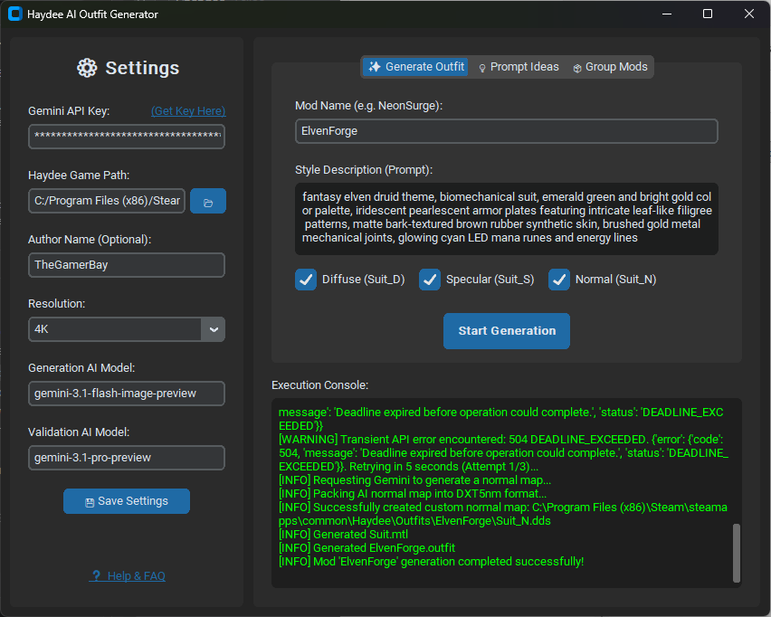
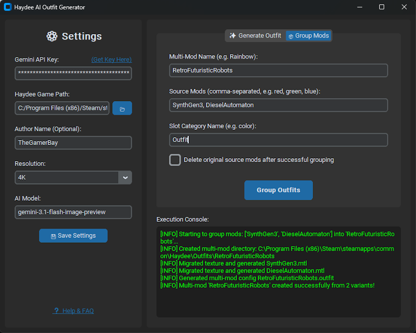

> 🌐 **Idiomas:** [English](README.md) | [Русский](README.ru.md) | [ไทย](README.th.md) | [中文](README.zh.md) | [Español](README.es.md) | [العربية](README.ar.md)

# Haydee AI Outfit Generator GUI

[](https://github.com/thegamerbay/haydee-ai-outfit-generator-gui/actions/workflows/ci.yml)
[](https://github.com/thegamerbay/haydee-ai-outfit-generator-gui/actions/workflows/release.yml)
[](https://github.com/thegamerbay/haydee-ai-outfit-generator-gui/actions/workflows/tests.yml)
[](https://github.com/thegamerbay/haydee-ai-outfit-generator-gui/actions/workflows/lint.yml)
[](https://codecov.io/gh/thegamerbay/haydee-ai-outfit-generator-gui)

Una interfaz gráfica de usuario moderna para la biblioteca [Haydee AI Outfit Generator](https://github.com/thegamerbay/haydee-ai-outfit-generator). ¡Genera fácilmente atuendos personalizados para Haydee sin tener que lidiar con terminales ni variables de entorno!

### 📥 [Descarga la última versión de HaydeeOutfitGenerator.exe aquí](https://github.com/thegamerbay/haydee-ai-outfit-generator-gui/releases)




## 🖼️ Ejemplos Generados

¡Mira lo que puedes crear! Los siguientes atuendos fueron generados usando esta herramienta y aparecen en el mod [Haydee: Tropical Harvest (Fruit-Themed Outfit Pack)](https://steamcommunity.com/sharedfiles/filedetails/?id=3677290023) en la Steam Workshop.

<p align="center">
  <a href="https://steamcommunity.com/sharedfiles/filedetails/?id=3677290023"></a>
  <a href="https://steamcommunity.com/sharedfiles/filedetails/?id=3677290023"></a>
  <a href="https://steamcommunity.com/sharedfiles/filedetails/?id=3677290023"></a>
  <a href="https://steamcommunity.com/sharedfiles/filedetails/?id=3677290023"></a>
  <a href="https://steamcommunity.com/sharedfiles/filedetails/?id=3677290023"></a>
  <a href="https://steamcommunity.com/sharedfiles/filedetails/?id=3677290023"></a>
  <a href="https://steamcommunity.com/sharedfiles/filedetails/?id=3677290023"></a>
</p>

## ✨ Características

- **Interfaz Oscura Moderna**: Creada con `CustomTkinter` para una apariencia elegante y tematizada de acuerdo al juego.
- **Dos Flujos de Trabajo Únicos**: Alterna sin problemas entre generar atuendos completamente nuevos mediante IA y agrupar tus mods existentes en un único multi-mod.
- **Control de Generación Granular**: Activa o desactiva de forma individual la generación de mapas Diffuse (Color), Specular (Material/Brillo) y Normal (Relieve 3D) para ahorrar peticiones a la API o regenerar partes específicas.
- **Modelos de IA Personalizables**: Elige exactamente qué modelo de IA de Gemini procesa tu solicitud (por ejemplo, `gemini-3.1-flash-image-preview` u otros modelos compatibles).
- **Resiliencia de Red**: Parches integrados de tiempo de espera (timeout) del SDK de 10 minutos y bucles automáticos de 3 reintentos en la API aseguran que tus generaciones no fallen debido a la congestión temporal de los servidores de Google o errores `503/504 Deadline Exceeded`.
- **Sin Necesidad de Terminal**: Configura todas las rutas y gestiona los registros (logs) automáticamente.
- **Procesamiento Asíncrono**: La interfaz se mantiene interactiva mientras el atuendo se genera mediante IA o mientras se agrupan los mods.
- **Ejecutable Independiente**: Empaqueta fácilmente la aplicación en un solo archivo `.exe` que cualquier usuario de Windows puede ejecutar al instante.

## 🚀 Inicio Rápido (Para Usuarios)

1. [Descarga la última versión de `HaydeeOutfitGenerator.exe`](https://github.com/thegamerbay/haydee-ai-outfit-generator-gui/releases).
2. Inicia la aplicación.
3. Completa el panel de **Configuración** (**Settings**):
   - Tu **Clave de API de Gemini**.
   - La ruta al directorio de instalación de tu juego **Haydee**.
   - Tu **Nombre de Autor** (Opcional, se aplica a todos los mods generados o agrupados).
   - Tu **Modelo de IA** (Por defecto es `gemini-3.1-flash-image-preview`).
4. Haz clic en **Guardar Configuración** (**Save Settings**).
5. Elige tu pestaña de flujo de trabajo:
   - **✨ Generar Atuendo** (**Generate Outfit**): Introduce un nombre único para el mod, un *prompt* de estilo descriptivo, y selecciona qué texturas quieres generar (Diffuse, Specular o Normal) antes de empezar.
   - **📦 Agrupar Mods** (**Group Mods**): Combina múltiples mods existentes en un multi-mod. Introduce el nombre del nuevo multi-mod, los mods de origen a agrupar (p. ej., `red, green, blue`) y la categoría de la ranura (p. ej., `color`).
6. Haz clic en **Iniciar Generación** (**Start Generation**) o **Agrupar Atuendos** (**Group Outfits**) ¡y observa cómo ocurre la magia en la ventana de consola integrada!

*(Nota: La aplicación guardará automáticamente tu configuración en `AppData/Local/HaydeeOutfitGenerator/settings.json` para que no tengas que introducir tus datos cada vez.)*

### 🔑 Cómo Obtener una Clave de API de Gemini

1. Ve a [Google AI Studio](https://aistudio.google.com/).
2. Inicia sesión con tu cuenta de Google.
3. Haz clic en el botón "Create API key" (Crear clave de API).
4. Si se te solicita, lee y acepta los términos de servicio.
5. Haz clic en "Create API key in new project" (Crear clave de API en un nuevo proyecto) o usa uno existente.
6. Copia la clave generada. Necesitarás pegarla en el panel de **Configuración** de la aplicación.

## 🛠️ Configuración para Desarrolladores

Si deseas contribuir o compilar la aplicación tú mismo:

### Requisitos Previos

- Python 3.12+
- Git

### Instalación

1. Clona este repositorio:
   ```bash
   git clone https://github.com/thegamerbay/haydee-ai-outfit-generator-gui.git
   cd haydee-ai-outfit-generator-gui
   ```

2. Instala las dependencias:
   ```bash
   pip install -r requirements.txt
   ```

3. Ejecuta la aplicación desde el código fuente:
   ```bash
   python main.py
   ```

### Compilando el Ejecutable

Este proyecto incluye un script automatizado que utiliza `PyInstaller` para empaquetar la aplicación en un archivo `.exe` independiente sin ventana de consola negra.

Para compilar:
```bash
python build.py
```

Una vez finalizada la compilación, tu aplicación estará disponible en la carpeta `dist/` como `HaydeeOutfitGenerator.exe`.

### Ejecutar Pruebas

Este proyecto incluye pruebas automatizadas de la interfaz gráfica escritas con `pytest` y `pytest-mock`.

1. Instala las dependencias de prueba:
   ```bash
   pip install -r requirements-dev.txt
   ```

2. Ejecuta las pruebas:
   ```bash
   pytest tests/
   ```

### Ejecutar Linting

Este proyecto utiliza `flake8` para aplicar el estilo de código.

1. Asegúrate de tener instaladas las dependencias de prueba:
   ```bash
   pip install -r requirements-dev.txt
   ```

2. Ejecuta el linter:
   ```bash
   flake8 src tests main.py build.py
   ```

## 📄 Licencia

Este proyecto está licenciado bajo la Licencia MIT - consulta el archivo [LICENSE](LICENSE) para más detalles.