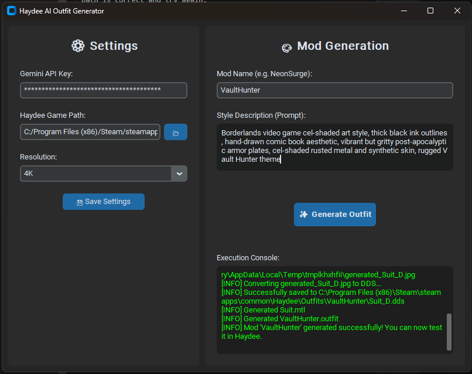

# Haydee AI Outfit Generator GUI

[](https://github.com/thegamerbay/haydee-ai-outfit-generator-gui/actions/workflows/ci.yml)
[](https://github.com/thegamerbay/haydee-ai-outfit-generator-gui/actions/workflows/release.yml)
[](https://github.com/thegamerbay/haydee-ai-outfit-generator-gui/actions/workflows/tests.yml)
[](https://github.com/thegamerbay/haydee-ai-outfit-generator-gui/actions/workflows/lint.yml)
[](https://codecov.io/gh/thegamerbay/haydee-ai-outfit-generator-gui)

A modern graphical user interface for the [Haydee AI Outfit Generator](https://github.com/thegamerbay/haydee-ai-outfit-generator) library. Easily generate custom outfits for Haydee without messing with terminals or environment variables!

### 📥 [Download the latest HaydeeOutfitGenerator.exe here](https://github.com/thegamerbay/haydee-ai-outfit-generator-gui/releases)



## ✨ Features

- **Modern Dark Interface**: Built with `CustomTkinter` for a sleek, game-themed appearance.
- **No Terminal Required**: Configures environment variables and handles logging automatically.
- **Asynchronous Generation**: The UI remains responsive while the outfit is being generated via AI.
- **Standalone Executable**: Easily package the app into a single `.exe` file that any Windows user can run out-of-the-box.

## 🚀 Quick Start (For Users)

1. [Download the latest `HaydeeOutfitGenerator.exe` release](https://github.com/thegamerbay/haydee-ai-outfit-generator-gui/releases).
2. Launch the application.
3. Fill in the **Settings** panel:
   - Your **Gemini API Key**.
   - Path to your **Haydee** game installation directory.
4. Click **Save Settings**.
5. In the **Mod Generation** panel, enter a unique mod name and a descriptive style prompt.
6. Click **Generate Outfit** and watch the magic happen in the built-in console window!

*(Note: The app will automatically create a `.env` file next to the `.exe` so you don't have to enter your details every time.)*

### 🔑 Getting a Gemini API Key

1. Go to [Google AI Studio](https://aistudio.google.com/).
2. Sign in with your Google account.
3. Click the "Create API key" button.
4. If prompted, read and accept the terms of service.
5. Click on "Create API key in new project" (or use an existing project).
6. Copy the generated key. You will need to paste it into the **Settings** panel of the application.

## 🛠️ Developer Setup

If you want to contribute or build the application yourself:

### Prerequisites

- Python 3.12+
- Git

### Installation

1. Clone this repository:
   ```bash
   git clone https://github.com/thegamerbay/haydee-ai-outfit-generator-gui.git
   cd haydee-ai-outfit-generator-gui
   ```

2. Install dependencies:
   ```bash
   pip install -r requirements.txt
   ```

3. Run the application from source:
   ```bash
   python main.py
   ```

### Building the Executable

This project includes an automated script that uses `PyInstaller` to package the app into a standalone `.exe` without a black console window.

To build:
```bash
python build.py
```

After the build completes, your application will be available in the `dist/` folder as `HaydeeOutfitGenerator.exe`.

### Running Tests

This project includes automated GUI tests written with `pytest` and `pytest-mock`.

1. Install the testing dependencies:
   ```bash
   pip install -r requirements-dev.txt
   ```

2. Run the tests:
   ```bash
   pytest tests/
   ```

### Running Linting

This project uses `flake8` to enforce code style.

1. Ensure testing dependencies are installed:
   ```bash
   pip install -r requirements-dev.txt
   ```

2. Run the linter:
   ```bash
   flake8 src tests main.py build.py
   ```

## 📄 License

This project is licensed under the MIT License - see the [LICENSE](LICENSE) file for details.
